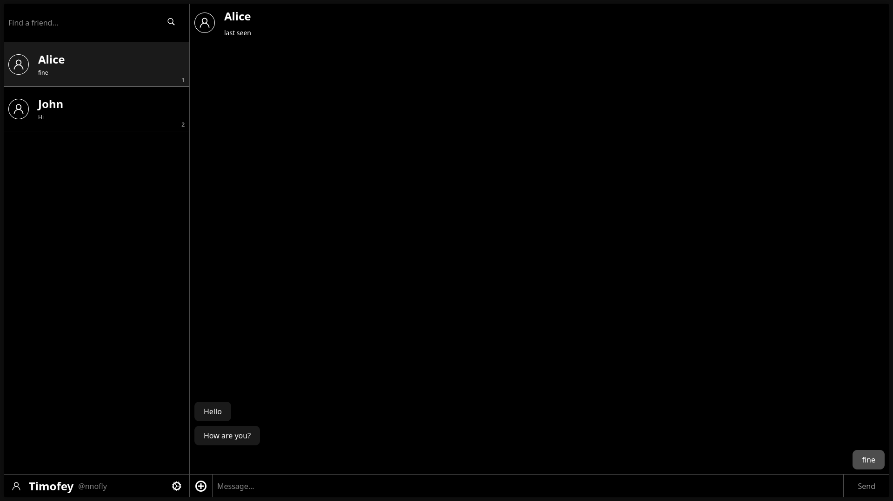

# Real-Time Chat Application




## 1. Introduction

This document provides a comprehensive overview of the Real-Time Chat application, a full-stack project featuring a C++ backend server and a React frontend. The application is designed to be a robust and scalable solution for real-time communication, leveraging a modular design for maintainability and extensibility.

## 2. Architecture

### 2.1. Frontend

The frontend is a modern, responsive single-page application built with React, Vite, and TypeScript. It provides a clean and intuitive user interface for a seamless user experience across various devices.

#### 2.1.1. Tech Stack

-   **[React](https://reactjs.org/):** A JavaScript library for building user interfaces.
-   **[Vite](https://vitejs.dev/):** A fast build tool and development server for modern web projects.
-   **[TypeScript](https://www.typescriptlang.org/):** A typed superset of JavaScript that compiles to plain JavaScript.
-   **[Zustand](https://github.com/pmndrs/zustand):** A small, fast, and scalable state management solution for React.
-   **[React Router](https://reactrouter.com/):** A declarative routing library for React.
-   **[CSS Modules](https://github.com/css-modules/css-modules):** For locally scoped CSS.

#### 2.1.2. Project Structure

The frontend project is organized into the following directories:

```
frontend/
├── public/               # Static assets
├── src/                  # Source code
│   ├── api/              # API service modules for backend communication
│   ├── assets/           # Images, fonts, etc.
│   ├── components/       # Reusable React components
│   ├── consts/           # Constants
│   ├── hooks/            # Custom React hooks
│   ├── pages/            # Application pages
│   ├── state/            # Zustand state management stores
│   ├── styles/           # Global styles and CSS variables
│   ├── types/            # TypeScript type definitions
│   └── utils/            # Utility functions
├── .eslintrc.cjs         # ESLint configuration
├── .prettierrc           # Prettier configuration
├── index.html            # HTML entry point
├── package.json          # Project dependencies and scripts
├── tsconfig.json         # TypeScript configuration
└── vite.config.ts        # Vite configuration
```

### 2.2. Backend

The backend is a C++ server designed for performance and scalability.

#### 2.2.1. Core Components

-   **Socket Layer:** Manages TCP connections with clients, handling low-level network communication.
-   **HTTP Layer:** Parses and handles HTTP requests for the server's RESTful API.
-   **Database Layer:** Interacts with a SQLite database for persistent storage of user data and chat history.
-   **Handlers Layer:** Contains the business logic for processing requests, interacting with the database, and generating responses.

#### 2.2.2. Directory Structure

The backend project is organized as follows:

```
server/
├── libs/         # Contains third-party libraries (e.g., nlohmann/json)
└── src/          # Main source code directory
    ├── db/       # Database layer for SQLite interaction
    ├── handlers/ # Business logic for handling requests
    ├── http/     # HTTP request parsing and handling
    ├── logger/   # Logger module
    ├── packet/   # Custom data packet creation and parsing
    └── socket/   # TCP connection management
```

## 3. Functionality

### 3.1. Frontend Features

-   **User Authentication:** Secure user registration and login.
-   **Real-Time Chat:** Instant messaging with other users.
-   **User Search:** Find and add new users to start conversations.
-   **Chat Management:** Create and delete chats.
-   **Responsive Design:** A mobile-first design that works on all screen sizes.

### 3.2. Backend Functionality

-   **User Authentication:** Supports user registration and login with secure password hashing.
-   **Chat Management:** Allows users to create and join chat rooms, send and receive messages, and view chat history.
-   **RESTful API:** Exposes a RESTful API for managing users, chats, and other resources.

## 4. Getting Started

### 4.1. Dependencies

-   **Backend:**
    - LLVM compiler for cpp
    - `make`
    - **nlohmann/json:** A C++ library for working with JSON data. (located in 'server/libs')
    - **SQLite:** A lightweight and efficient SQL database engine.
    - **OpenSSL:** A cryptographic library used for secure communication over the network.

-   **Frontend:**
    - [Node.js](https://nodejs.org/) (v18 or higher),
    - [pnpm](https://pnpm.io/) (or npm/yarn)

### 4.2. Backend Setup

The server can be built and run using the provided `Makefile`.

-   `make all`: Builds the server.
-   `make run`: Builds and runs the server.
-   `make debug`: Builds the server with debugging symbols.
-   `make clean`: Cleans the build directory.

### 4.3. Frontend Setup

-   `pnpm dev`: Starts the development server.
-   `pnpm build`: Builds the application for production.
-   `pnpm lint`: Lints the codebase using ESLint.
-   `pnpm preview`: Serves the production build locally for preview.

1.  Navigate to the frontend directory:
    ```bash
    cd frontend
    ```
2.  Install dependencies:
    ```bash
    pnpm install
    ```
3.  Run the development server:
    ```bash
    pnpm dev
    ```
    The application will be available at `http://localhost:5173`.

## 5. Usage

Default paths located in `server/src/config.h`

```cpp
constexpr const char* DEFAULT_DB_PATH = "Default path";
constexpr const char* DEFAULT_FRONTEND_PATH = "Default path";
```

After setting the paths:
1. Build the server bin: `cd server/ && make build`
2. Install dependencies for frontend side: `cd ../frontend && npm i`
4. And build it: `npm build`
5. Than you need to create a database. In `db/` there is a file `query.sql`, just: `sqlite3 db/db.sqlite3 < db/query.sql`
6. `cd server && make run`

## 6. Opinions and Recommendations

While the application is functional, several areas warrant improvement to enhance its quality and robustness.

-   **Testing:** The absence of a dedicated testing framework is a significant deficiency. Implementing a testing framework, such as Google Test for the backend and React Testing Library for the frontend, would substantially improve code reliability.
-   **Error Handling:** Error handling is inconsistent. A more robust and uniform error handling mechanism across both client and server would improve reliability and ease of debugging.
-   **Configuration:** Configuration is hard-coded. Externalizing configuration to a separate file (e.g., JSON or YAML) would simplify deployment and management in different environments.
-   **Security:** Security can be enhanced by implementing measures such as input validation, output encoding, and rate limiting on the server.
